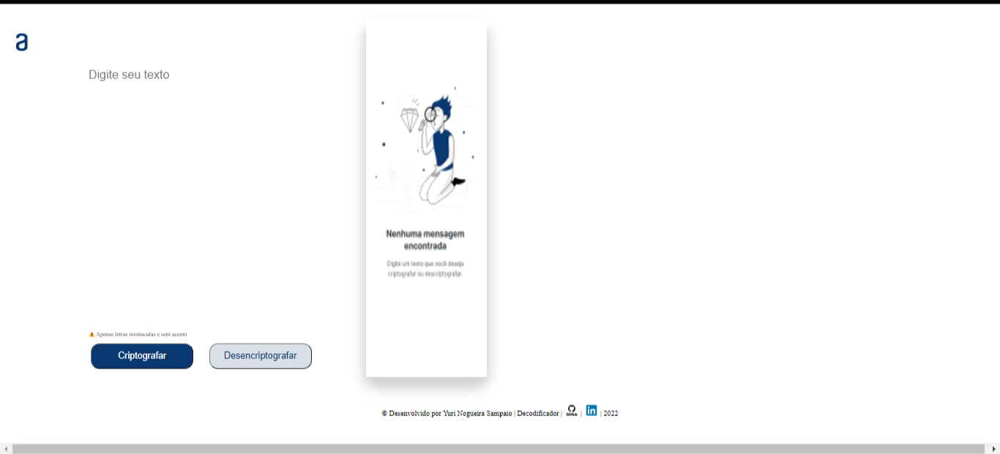
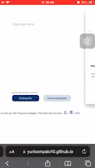
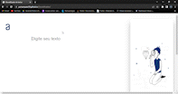

# 
:lock: ENCRIPTADOR :old_key::unlock:

 
### 
:green_circle: Projeto Proposto no Programa ONE - Oracle & Alura! :green_circle:

___

[ 
 ](https://github.com/euclides981/criptografia#readme) 

[
](https://github.com/YuriSampaio10/Decodificador#readme)
  
 

___
### :black_nib: Descrição:

Este é um sistema de codificação de palavras que transforma as vogais em palavras:

### 🔽: Exemplo de como as trocas são feitas:

- `Vogal a: `Transforma em : ai
- `Vogal e: `Transforma em : enter
- `Vogal i: `Transforma em : imes
- `Vogal o: `Transforma em : ober
- `Vogal u: `Transforma em : ufat
___
###  
:computer: A seguir apresento a prévia do projeto.:computer:

___
###  
:iphone: Uma Prévia em dispositivos menores.:iphone:

___
###  
:on: Uma prévia do sistema em funcionamento.:on:

___
### 
:heavy_check_mark: Links Uteis

[
](https://github.com/YuriSampaio10/Decodificador/releases/tag/v0.1.0)

___

### 
:star::star::star:
 

### 

